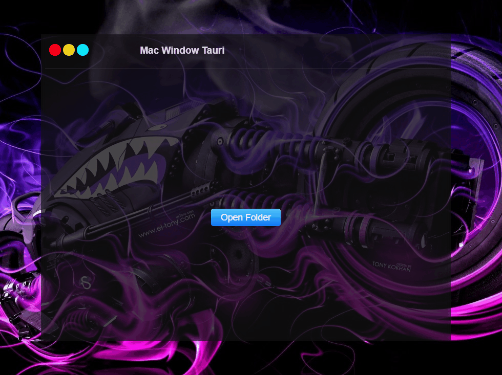

<div center="true">
    <h1>Tauri MacWindow File Browser 📁</h1>
    

</div>


# Tauri Desktop Apps Course ❤️‍🔥


### Desciption ✨
Tauri Desktop App Cross platform , we make a some mini file manager that can open spisifiec folder & manage it (rename files and folders and remove it )  


## Technologies 🚀

### Frontend 👾 
 - [HTML & CSS ](https://www.youtube.com/playlist?list=PLGMjH0KDBZRh-Q3zNMT_QN4rWGxg-Otjg)
 - [Javascript](https://www.youtube.com/playlist?list=PLGMjH0KDBZRi6kBYPPhkQG8zQ0GkkXNVz)

 ### Backend 🤖
 - [Rust](https://www.youtube.com/playlist?list=PLGMjH0KDBZRj2ktA_2psZLJAdJUtzqzJj)


## Install ✌️

To Install new Project  run

```bash
  npm create tauri-app
```

OR 


```bash
 cargo install create-tauri-app
 cargo create-tauri-app
```

## Features 👓

- dark transeparent background 
- close min & maximize like Mac Os 
- Very Fast 
- Cross platform


## Run Locally 🧑🏼‍✈️

Clone the project

```bash
  git clone https://github.com/udc2020/macwindow-tauri.git
```

Go to the project directory

```bash
  cd macwindow-tauri
```

Install dependencies

```bash
  npm install
```

run app

```bash
  npm run tauri dev
```


